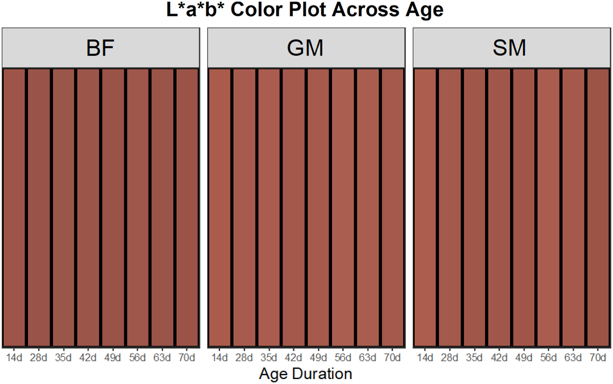
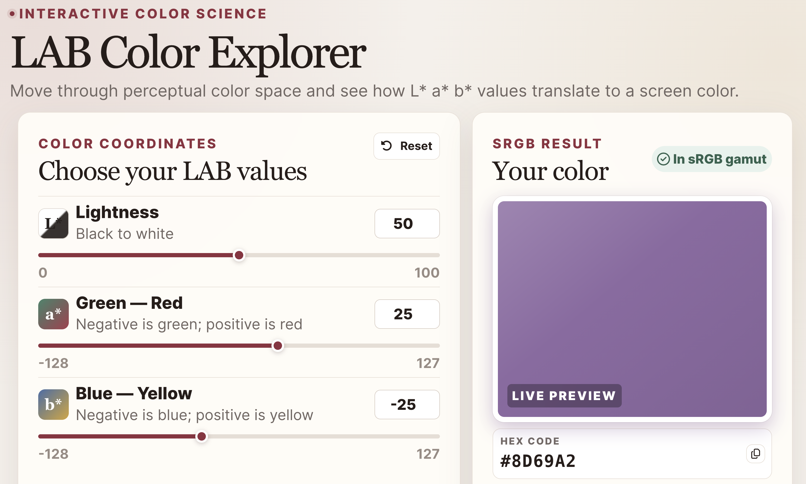

# MeatColor

<!-- badges: start -->
[](https://github.com/JustSplash8501/MeatColor/actions/workflows/R-CMD-check.yaml)
[](https://lifecycle.r-lib.org/articles/stages.html#experimental)
[](https://github.com/JustSplash8501/MeatColor)
[](https://opensource.org/licenses/MIT)
<!-- badges: end -->

MeatColor is an R package for turning instrumental meat-color measurements
into analysis-ready summaries, interpretable comparisons, and
publication-ready graphics. It works with CIE L\*a\*b\* colorimeter data and
spectral reflectance measurements, bringing common meat-science calculations
into one reproducible workflow.

Instrumental color data are easy to collect but often tedious to analyze.
Researchers must summarize repeated measurements, convert coordinates into
meaningful color metrics, compare treatments, apply specialized myoglobin
equations, and build figures—usually with separate formulas and scripts.
MeatColor connects those steps while keeping the data in ordinary R data
frames and returning plots that can be customized with ggplot2.

## Why MeatColor?

- **Built for meat-color experiments.** Group measurements by treatment,
  product, storage time, or other experimental factors.
- **More than L\*a\*b\* averages.** Calculate hue, chroma, CIEDE2000 color
  differences, and surface myoglobin redox-form estimates.
- **Treatment-aware comparisons.** Compare every sample pair, summarize
  within- and between-treatment distances, and visualize the results.
- **Transparent scientific behavior.** Input scales and out-of-range handling
  are explicit; questionable estimates are not silently hidden.
- **Fits existing R workflows.** Functions accept data frames, support tidy
  column selection where appropriate, and return regular data frames or
  ggplot objects.

## At a glance

| Research task | Main functions | Result |
|---|---|---|
| Summarize and display instrumental color | `summarize_lab()`, `plot_lab_colors()` | Treatment-level L\*a\*b\* summaries and color charts |
| Calculate color attributes | `lab_chroma()`, `lab_hue()`, `add_lab_metrics()` | Chroma and hue-angle variables |
| Approximate measured color on screen | `lab_to_hex()` | CIELAB-to-sRGB hexadecimal approximations |
| Quantify perceptual color differences | `delta_e_2000()`, `lab_distances()` | Paired or all-pairs CIEDE2000 distances |
| Compare treatments | `summarize_treatment_distances()`, `plot_treatment_distances()` | Treatment summaries and heatmaps |
| Estimate myoglobin redox forms | `myoglobin_int()`, `myoglobin_ref()` | OMb, DMb, and MMb estimates from reflectance |
| Reuse prepared-reference calibrations | `myoglobin_calibration()`, `predict()` | Validated calibration objects and predictions |

## Installation

MeatColor requires R 4.1.0 or later. Install the development version from
GitHub with:

``` r
# install.packages("pak")
pak::pak("JustSplash8501/MeatColor")
```

## Quick start

Start with a data frame containing L\*, a\*, and b\* measurements plus the
variables that define the experiment:

``` r
library(MeatColor)

measurements <- data.frame(
  sample = paste0("S", 1:8),
  treatment = rep(c("Control", "Aged"), each = 4),
  day = rep(c("Day 0", "Day 7"), each = 2, times = 2),
  l = c(45.2, 44.8, 42.1, 41.9, 46.1, 45.9, 43.2, 42.8),
  a = c(18.5, 18.8, 16.2, 16.5, 17.9, 18.1, 15.8, 16.1),
  b = c(12.1, 12.3, 10.5, 10.7, 11.8, 12.0, 10.3, 10.5)
)

color_summary <- summarize_lab(
  measurements,
  group_vars = c("treatment", "day")
)

plot_lab_colors(
  color_summary,
  x_var = "day",
  group_var = "treatment",
  x_label = "Storage time",
  group_label = "Treatment",
  title = "Instrumental meat color over time",
  show_values = "lab"
)
```

`summarize_lab()` calculates group means and display-color approximations.
`plot_lab_colors()` turns those results into a treatment-aware chart and
returns a regular ggplot object, so themes, labels, scales, and other ggplot2
layers can be added normally.

### What the workflow can produce



This figure shows instrumental color across wet-aging durations in a published
beef study. It illustrates how MeatColor can make changes among treatments and
time points visually comparable while retaining the underlying quantitative
measurements.

*Source:* Main, A. J., Frink, L. M., Hernandez, M. S., O'Quinn, T. G.,
Legako, J. F., Miller, R. K., Nair, M. N., Kerth, C. R., Lancaster, J. M., &
Woerner, D. R. (2026). “Extended Beef Wet-Aging Influences on *Biceps
femoris*, *Gluteus medius* and *Semimembranosus* Palatability.” *Meat and
Muscle Biology, 10*(1), 22594, 1–19.
[https://doi.org/10.22175/mmb.22594](https://doi.org/10.22175/mmb.22594)

## Compare samples and treatments

CIELAB coordinates can look different without revealing how large that
difference is perceptually. `lab_distances()` calculates CIEDE2000 (Delta E 00)
for every sample pair, without requiring a designated reference sample:

``` r
distances <- lab_distances(measurements, sample_id = sample)

# Symmetric sample-by-sample matrix
as.matrix(distances)

# Unique within- and between-treatment comparisons
treatment_distances <- summarize_treatment_distances(
  distances,
  treatment = treatment
)

# Treatment-level CIEDE2000 heatmap
plot(distances, treatment = treatment)
```

Self-comparisons and duplicate A–B/B–A combinations are excluded from
treatment summaries. The lower-level `delta_e_2000()` function remains
available when colors are deliberately paired or a true reference color
exists.

## Estimate myoglobin redox forms

MeatColor supports two reflectance-based approaches for estimating relative
oxymyoglobin (OMb), deoxymyoglobin (DMb), and metmyoglobin (MMb):

1. `myoglobin_int()` applies the selected-wavelength reflex-attenuance
   equations to MiniScan reflectance data.
2. `myoglobin_ref()` applies calibrated K/S equations using experimentally
   prepared 100% OMb, DMb, and MMb reference spectra.

For studies that repeatedly use the same prepared references,
`myoglobin_calibration()` creates a validated object that can be applied to
multiple sample data sets with `predict()`:

``` r
calibration <- myoglobin_calibration(
  omb_reference = omb_reference_scans,
  dmb_reference = dmb_reference_scans,
  mmb_reference = mmb_reference_scans,
  reflectance_scale = "percent"
)

myoglobin_results <- predict(calibration, newdata = sample_scans)
plot(calibration)
```

Reference scans and study samples should be collected with the same product,
instrument settings, standardization, and experimental conditions. Estimates
outside 0–100% are retained with a warning by default rather than silently
altered.

## Scientific basis and interpretation

MeatColor implements established color-science methods while making important
assumptions visible to the analyst:

- **CIELAB display colors are approximations.** Physical L\*a\*b\* measurements
  are converted to sRGB for visualization; some measured colors fall outside
  the displayable sRGB gamut.
- **Color differences use CIEDE2000.** The implementation follows Sharma, Wu,
  and Dalal (2005), with configurable lightness, chroma, and hue weighting
  factors. [https://doi.org/10.1002/col.20070](https://doi.org/10.1002/col.20070)
- **Myoglobin calculations follow AMSA guidance.** The package implements both
  selected-wavelength and prepared-reference approaches described in the
  *AMSA Meat Color Measurement Guidelines*.

See the [conversion formulation](formulation.md) for the CIELAB-to-CIEXYZ-to-
sRGB mathematics. Researchers remain responsible for choosing a method and
instrument configuration appropriate to their product and study design.

*References:* American Meat Science Association. (2012). *Meat Color
Measurement Guidelines* (revised December 2012).
[View the guidelines](https://meatscience.org/docs/default-source/publications-resources/hot-topics/2012_12_meat_clr_guide.pdf?sfvrsn=d818b8b3_0).
King, D. A., et al. (2023). “American Meat Science Association Guidelines for
Meat Color Measurement.” *Meat and Muscle Biology, 6*(4), 1–81.
[https://doi.org/10.22175/mmb.12473](https://doi.org/10.22175/mmb.12473)

## Teach and explore CIELAB color

The hosted [LAB Color Explorer](https://0bl00z-secret.shinyapps.io/meatcolor-lab-explorer/)
helps students connect L\*, a\*, and b\* coordinates with an approximate screen
color. Sliders and numeric inputs make each axis immediately visible:

- **L\*** represents lightness, from 0 (black) to 100 (white).
- **a\*** moves from green at negative values to red at positive values.
- **b\*** moves from blue at negative values to yellow at positive values.



The explorer also identifies out-of-gamut colors, demonstrating why some
physical CIELAB measurements cannot be represented exactly on a screen. The
teaching app is hosted separately; its source code is not part of this package.

## Documentation and support

- Start with the [introductory vignette](vignettes/intro-to-meatcolor.Rmd) for
  a fuller analysis workflow.
- Use `help(package = "MeatColor")` or `?function_name` for function-level
  documentation.
- Report reproducible problems through the
  [issue tracker](https://github.com/JustSplash8501/MeatColor/issues).
- Read [CONTRIBUTING.md](CONTRIBUTING.md) before proposing substantial changes.

MeatColor is currently experimental. Interfaces may evolve as the package is
tested across more instruments, products, and study designs.

## Code of Conduct

Participation in this project is governed by the
[Contributor Covenant Code of Conduct](CODE_OF_CONDUCT.md).
